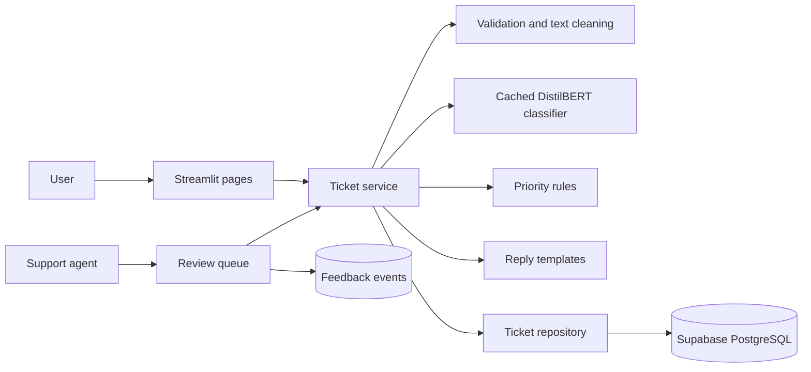

# AI Support Ticket Classifier

## 1. Project overview

An end-to-end support-ticket triage app built with Streamlit, a fine-tuned DistilBERT
classifier, rule-based priority assignment, reply templates, and Supabase. Agents can
review low-confidence tickets, correct model output, and track service activity.

The interface supports light and dark themes. Training and evaluation run offline;
the deployed app only performs inference and ticket workflows.

## 2. Features

- Classifies ticket text into eight support categories and returns confidence scores.
- Assigns priority with transparent, configurable YAML rules.
- Drafts a category-specific response that an agent can edit.
- Routes low-confidence predictions to a review queue.
- Lets agents update category, priority, status, and feedback notes.
- Preserves original model predictions when an agent changes a ticket.
- Provides ticket search/history, filters, pagination, and an analytics dashboard.
- Uses a configurable confidence threshold and a light/dark theme selector.

## 3. Architecture and workflow



Submission flow: validate and clean input, predict a category, apply the priority
policy, generate a reply draft, and store the ticket and prediction. Tickets below
the confidence threshold enter `needs_review`. Agents can correct the result; those
changes are recorded for future model improvement.

## 4. Tech stack

- **Language/UI:** Python 3.10+, Streamlit
- **NLP:** Hugging Face Transformers, DistilBERT, PyTorch
- **Data and metrics:** pandas, scikit-learn, matplotlib, Plotly
- **Storage:** Supabase client and PostgreSQL
- **Configuration:** YAML rules/templates, `.env` or Streamlit secrets
- **Tests:** pytest

See [`requirements.txt`](requirements.txt) for package constraints.

## 5. Dataset and categories

The prepared classifier dataset contains **13,862 examples** assembled from Bitext,
ABCD, and a small generated technical set. Bitext and ABCD contribute 9,970 and
3,492 examples respectively; the remaining 400 Technical examples are deterministic
synthetic starters.

| Category | Examples |
|---|---:|
| Account | 2,000 |
| Delivery | 2,000 |
| General | 1,998 |
| Refund | 1,951 |
| Payment | 1,926 |
| Subscription | 1,417 |
| Other | 1,452 |
| Technical | 1,118 |

Labels: **Account, Payment, Technical, Refund, Delivery, Subscription, General, Other**.
The mapping, data preparation steps, source notes, and licensing references are in
[`docs/bitext_mapping.md`](docs/bitext_mapping.md).

## 6. Model and training

- Base model: `distilbert-base-uncased`, fine-tuned for eight-way sequence classification.
- Split: stratified 70% train / 15% validation / 15% test, seed 42.
- Training defaults: 4 epochs, learning rate `2e-5`, batch size 16, max sequence length 128.
- The checkpoint with the best validation macro F1 is saved to `models/ticket_classifier/`.
- CUDA is used automatically when available; fp16 is enabled only on CUDA. Pass `--require-gpu` to fail rather than train on CPU.

Prepare data and train with `python -m ml.prepare_bitext` and `python -m ml.train`.
The training script reads the source files described in `docs/bitext_mapping.md`.
For a Colab workflow, see [`notebooks/colab_finetune.ipynb`](notebooks/colab_finetune.ipynb).

## 7. Evaluation results

Saved held-out test results from `models/evaluation/metrics.json`:

| Metric | Result |
|---|---:|
| Test examples | 2,080 |
| Accuracy | 99.28% |
| Macro precision | 99.29% |
| Macro recall | 99.30% |
| Macro F1 | 99.29% |
| Misclassified | 15 |
| CPU inference mean / p95 | 54.8 ms / 69.8 ms per ticket |

These are results on this prepared split, **not a production-quality estimate**.
Bitext is generated text, ABCD is role-play dialogue, and part of the Technical class
is synthetic. Near-duplicate paraphrases may also appear across a random split. Evaluate
on representative, independently collected and labeled customer tickets before relying
on these scores.

Run `python -m ml.evaluate` to regenerate metrics, a confusion matrix, and
misclassified examples under `models/evaluation/`.

## 8. Project structure

```text
app.py                         Home page and readiness checks
pages/                         Submit, review, history, and dashboard screens
services/                      Ticket orchestration, model, rules, replies, database access
preprocessing/                 Input validation and model-text preparation
ml/                            Dataset preparation, training, and evaluation
config/                        Settings, priority rules, and response templates
.streamlit/config.toml         Light/dark theme configuration
sql/schema.sql                 Supabase PostgreSQL schema
tests/                         Unit and workflow tests
data/                          Raw and prepared datasets (local, git-ignored)
models/                        Model and evaluation artifacts (local, git-ignored)
```

## 9. Installation and `.env` setup

Create a Supabase project and run [`sql/schema.sql`](sql/schema.sql) in its SQL editor.
Then create a virtual environment and install dependencies. PowerShell commands:

```powershell
python -m venv .venv
.\.venv\Scripts\Activate.ps1
python -m pip install --upgrade pip
python -m pip install -r requirements.txt
```

Create a `.env` file in the project root:

```dotenv
SUPABASE_URL=https://your-project-ref.supabase.co
SUPABASE_KEY=your-server-side-service-role-key
CONFIDENCE_THRESHOLD=0.60
PAGE_SIZE=20
LOG_LEVEL=INFO
```

Use a server-side Supabase key only. `.env` and `.streamlit/secrets.toml` are
git-ignored; never commit or expose credentials to the browser. Alternatively,
provide the same settings through Streamlit secrets.

The raw Bitext and ABCD source files are not included. Follow the download and
preparation instructions in [`docs/bitext_mapping.md`](docs/bitext_mapping.md), then run:

```powershell
python -m ml.make_extra_technical_data
python -m ml.prepare_bitext --extra-technical data/raw/extra_technical.csv
python -m ml.train
python -m ml.evaluate
```

## 10. Run instructions

From the project root, with the virtual environment active:

```powershell
python -m streamlit run app.py
```

Open the local URL printed by Streamlit, usually `http://localhost:8501`. Select
**System**, **Light**, or **Dark** in the top-right main menu. Run the tests with:

```powershell
python -m pytest -q
```

## 11. Example

Example ticket input:

```text
Subject: Unauthorized activity on my account
Message: I did not make this purchase, and money was deducted from my account.
```

The classifier supplies a category and confidence, the priority policy flags
unauthorized activity as **High**, and the app drafts a response. If confidence is
below the configured 0.60 threshold, the ticket is saved for agent review. The exact
category and reply depend on the trained model and configured templates.

## 12. Limitations and future improvements


- Priority assignment is keyword/rule based; misspellings and context can be missed, and the classifier does not determine priority.
- The app has no authentication/roles and does not send email; add access control before external deployment and integrate a reviewed reply channel.
- Dashboard reads at most 20,000 tickets per refresh. Search uses `ILIKE`; enable the optional `pg_trgm` indexes for larger datasets.
- Future work: calibrate confidence on production-like data, monitor drift and per-class performance, expand Technical/Subscription coverage, and improve large-scale search and pagination.
